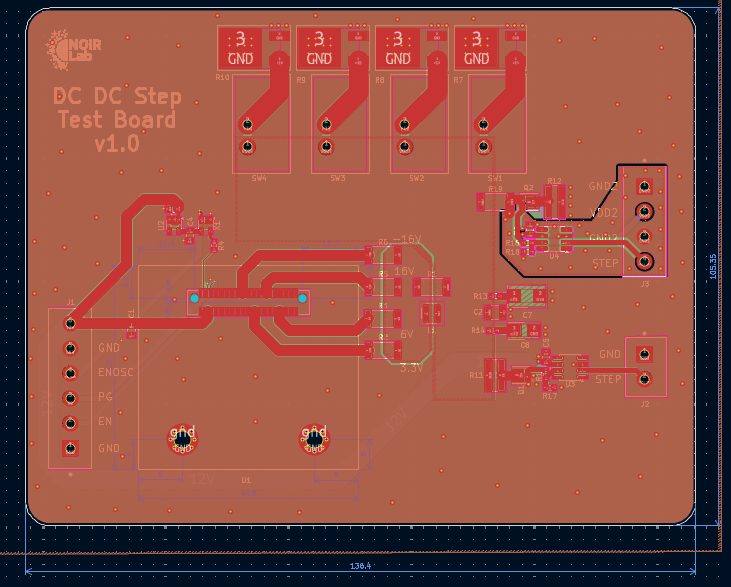
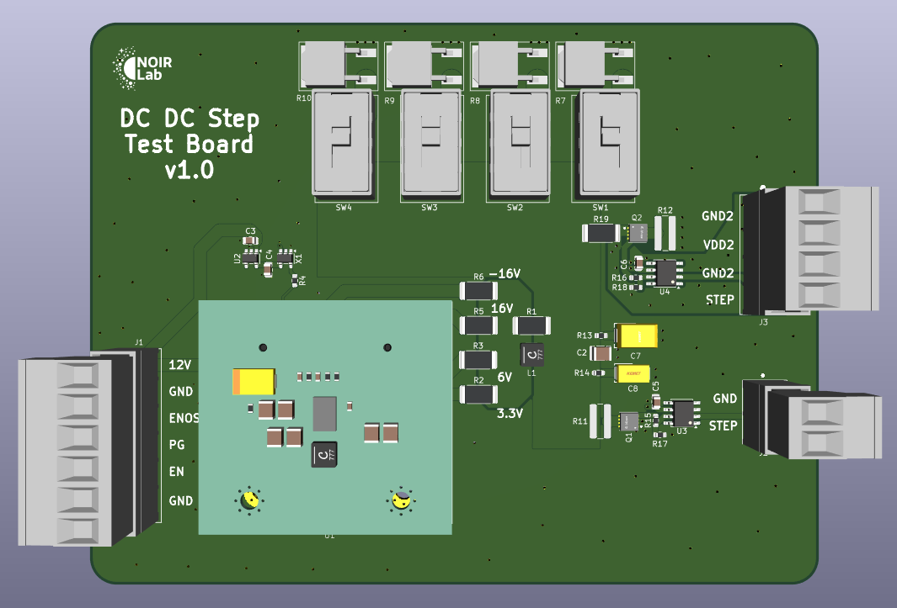

# mdc-test-power-step
Modular Detector Controller Test Power Step Board

## Overview
This board generates controlled load steps at multiple bias rails to evaluate DC/DC module stability, settling, and control-loop bandwidth under different load conditions. It is intended to be used alongside the `mdc-power-*` DC/DC module boards.

## Objective
- Test stability and transient response across different bias rails.
- Measure settling time and bandwidth under programmable load conditions.

## System Context
- DC/DC generation is provided by the `mdc-power-*` boards.
- This board provides load-step capability and measurement access for those rails.
- Board input: 12V.

## Board Stackup
- 4-layer PCB

## Board Dimensions
- 136.4 mm x 105.35 mm

## CAD
- Designed using KiCad 9.

## Key Functions
- Programmable load steps using MOSFET-switched resistor banks.
- Multiple selectable load levels per rail.
- Local support rails and timing (LDO + oscillator) for step control.
- External 3.3V step input for injecting step signals on both positive and negative DUT outputs.
- 2 MHz oscillator to provide a sync reference for the DC-DC DUT.

## Images
Layout:

3D view:

## Load Step Networks (from schematic)
High-power resistors (primary load steps):
- 3.3V: 2 ohm, 6 A, `PWR163S-25-2R00F`
- 6V: 8 ohm, 3 A, `PWR163S-25-8R00F`
- 16V: 120 ohm, 0.5 A, `PWR163S-25-1200F`

Alternate lower-power options (noted on schematic):
- 3.3V: 5.6 ohm, 0.6 A, `LTR100JZPF5R60`
- 6V: 20 ohm, 0.3 A, `LTR100JZPF20R0`
- 16V: 320 ohm, 0.05 A, `LTR100JZPF3300`

## Relevant ICs and Roles
- `U2: LP2980` LDO regulator for local low-power rail.
- `X1: SiT2024B` oscillator for step timing/control.
- `U3/U4: UCC27531D` gate drivers for MOSFET-switched loads.
- `Q1/Q2: ISZ015N04NM7V` power MOSFETs for load switching.

## Signals (from schematic)
- Control and status: `en`, `pg`, `sync`, `en_osc`, `step_pos`

## Files
- Schematic: `test_power_step.pdf`
